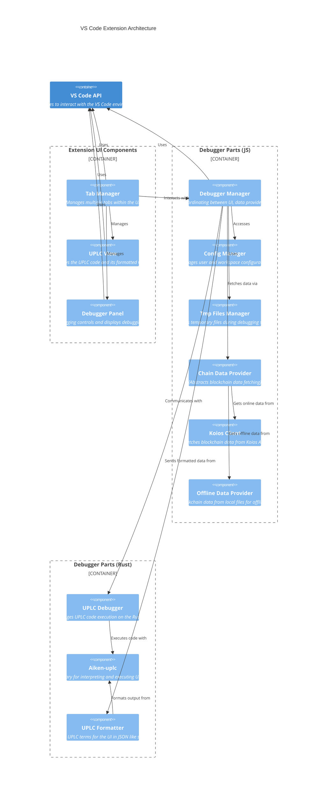

```mermaid
C4Component
title VS Code Extension Architecture

%% Extension UI Components
Container_Boundary(UI, "Extension UI Components") {
    Component(TabManager, "Tab Manager", "Manages multiple tabs within the UI")
    Component(UPLCView, "UPLC View", "Displays the UPLC code and its formatted version")
    Component(DebuggerPanel, "Debugger Panel", "Provides debugging controls and displays debugging information")
}

%% VS Code API
Container(VSCodeAPI, "VS Code API", "Interfaces to interact with the VS Code environment")

%% Debugger Parts (JS)
Container_Boundary(JSDebugger, "Debugger Parts (JS)") {
    Component(DebuggerManager, "Debugger Manager", "Central controller coordinating between UI, data providers, and Rust backend")
    Component(ConfigManager, "Config Manager", "Manages user and workspace configurations")
    Component(TmpFilesManager, "Tmp Files Manager", "Handles temporary files during debugging sessions")
    Component(ChainDataProvider, "Chain Data Provider", "Abstracts blockchain data fetching")    
    Component(KoiosClientJS, "Koios Client", "Fetches blockchain data from Koios API")
    Component(OfflineDataProvider, "Offline Data Provider", "Provides blockchain data from local files for offline debugging")
}

%% Debugger Parts (Rust)
Container_Boundary(RustDebugger, "Debugger Parts (Rust)") {
    Component(RustUPLCDebugger, "UPLC Debugger", "Manages UPLC code execution on the Rust side")
    Component(AikenUPLC, "Aiken-uplc", "Rust library for interpreting and executing UPLC code")
    Component(UPLCFormatter, "UPLC Formatter", "Formats UPLC terms for the UI in JSON like structure")
}

%% Relationships
Rel(TabManager, UPLCView, "Manages")
Rel(TabManager, DebuggerPanel, "Manages")

Rel(TabManager, DebuggerManager, "Interacts with")
Rel(DebuggerManager, VSCodeAPI, "Uses")
Rel(DebuggerManager, ConfigManager, "Accesses")
Rel(DebuggerManager, TmpFilesManager, "Uses")
Rel(DebuggerManager, ChainDataProvider, "Fetches data via")
Rel(DebuggerManager, RustUPLCDebugger, "Communicates with")

Rel(ChainDataProvider, KoiosClientJS, "Gets online data from")
Rel(ChainDataProvider, OfflineDataProvider, "Gets offline data from")

Rel(RustUPLCDebugger, AikenUPLC, "Executes code with")
Rel(UPLCFormatter, AikenUPLC, "Formats output from")
Rel(DebuggerManager, UPLCFormatter, "Sends formatted data from")

Rel(TabManager, VSCodeAPI, "Uses")
Rel(UPLCView, VSCodeAPI, "Uses")
Rel(DebuggerPanel, VSCodeAPI, "Uses")
```
