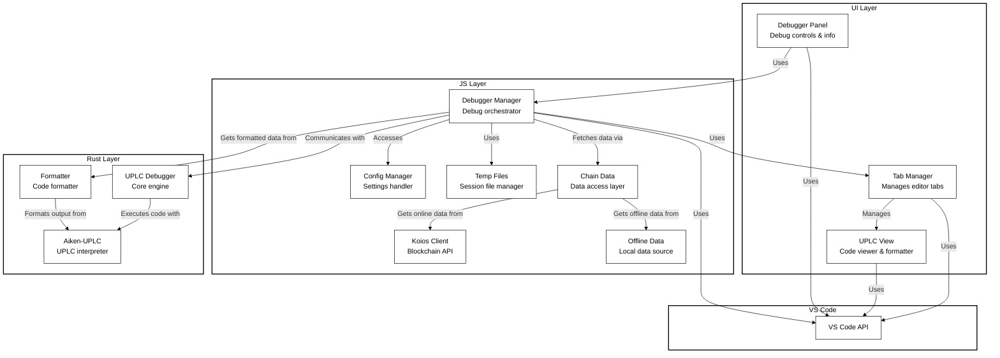

```mermaid
graph TB
    %% Styling
    classDef container fill:#fff,stroke:#000,stroke-width:2px;
    classDef component fill:#fff,stroke:#000,color:#000;
    classDef default fill:#fff,stroke:#000,color:#000;
    classDef subgraphStyle fill:#fff,stroke:#000,color:#000;
    linkStyle default stroke:#000,stroke-width:1px;

    subgraph UI["UI Layer"]
        TM["Tab Manager<br/>Manages editor tabs"]
        UV["UPLC View<br/>Code viewer & formatter"]
        DP["Debugger Panel<br/>Debug controls & info"]
    end

    subgraph VS["VS Code"]
        API["VS Code API"]
    end

    subgraph JS["JS Layer"]
        DM["Debugger Manager<br/>Debug orchestrator"]
        CM["Config Manager<br/>Settings handler"]
        TF["Temp Files<br/>Session file manager"]
        CD["Chain Data<br/>Data access layer"]
        KC["Koios Client<br/>Blockchain API"]
        OD["Offline Data<br/>Local data source"]
    end

    subgraph Rust["Rust Layer"]
        UD["UPLC Debugger<br/>Core engine"]
        AU["Aiken-UPLC<br/>UPLC interpreter"]
        FM["Formatter<br/>Code formatter"]
    end

    %% Relationships
    DM --> |Uses| TM
    TM --> |Manages| UV
    DP --> |Uses| DM

    TM --> |Uses| API
    UV --> |Uses| API 
    DP --> |Uses| API

    DM --> |Uses| API
    DM --> |Accesses| CM
    DM --> |Uses| TF
    DM --> |Fetches data via| CD
    DM --> |Communicates with| UD
    DM --> |Gets formatted data from| FM

    CD --> |Gets online data from| KC
    CD --> |Gets offline data from| OD

    UD --> |Executes code with| AU
    FM --> |Formats output from| AU

   %% Apply styles
    class UI,JS,Rust,VS container;
    class TM,UV,DP,DM,CM,TF,CD,KC,OD,UD,AU,FM component;
    class UI,VS,JS,Rust subgraphStyle;
```
